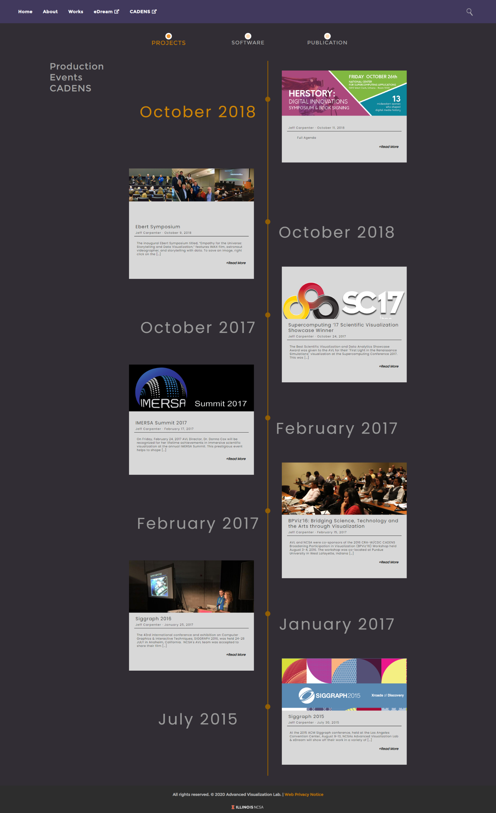

During my SPIN (student-pushing innovation) internship at the Advanced Visualization Lab (AVL) at the National Center for Supercomputing Applications (NCSA) while I was a student at UIUC, I developed a new WordPress theme for the AVL's website based on our design intern [Dawn Nguyen's designs](http://dawnuxi.com/avl.html).

The AVL's original website was outdated in style, difficult to navigate, and not mobile-friendly. I wrote templates in PHP to generate blog posts, coded animation-rich static pages for displaying information about the lab, and made the website responsive for easy navigation on mobile. To bring Dawn's vibrant designs to life, I worked closely with her as I implemented her design page by page. Learning to use PHP to define page templates in WordPress was a bit of a challenge, but I was nonetheless able to get the Works and Events pages to look close to the designs.

I received the <b>Fiddler Innovation Award</b> for this web developmnt work in October 2018. See [this NCSA story](http://www.ncsa.illinois.edu/news/story/16_students_receive_ncsas_fiddler_innovation_fellowships) to read more about the award.

My work has been live at [http://avl.ncsa.illinois.edu/](http://avl.ncsa.illinois.edu/) since summer 2018. Below are some screenshots showing the website's change in looks. 

## Old Website

↪ The homepage of the AVL's website used in 2013-2018.

## Select Screenshots of the New Look

↪ The What We do -> Process static page.

↪ The Events page that automatically puts highlights the newest event post at the top of the timeline.
