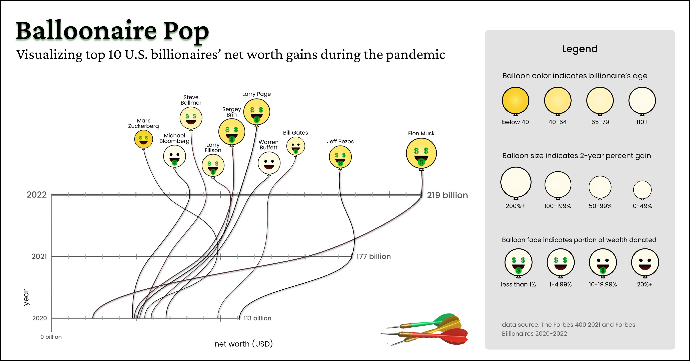

In Spring 2022, I took the Design of Data course at the Stanford d.school. For one of the assignments, the instructors asked us to pick one Nobel Peace Prize lecture, find a dataset related to the lecture, and create an infographic in the style of a well-known visualization designer's work. Deeply moved by the [World Food Programme's lecture](https://www.youtube.com/watch?v=WV5zYKHuYso&ab_channel=NobelPrize), I created the "Balloonaire Pop" infographic in the style of [Valentina D'Efilipo's Poppy Field](http://www.valentinadefilippo.co.uk/work/#Section-5).

In the lecture, the speaker specifically called out billionaires in the world who earned an additional $1.8 trillion in total during the pandemic, and urged them to donate a total of $6.6 billion to end the hunger emergency. So I got the idea to visualize how the top 10 US-based billionaires' net worths changed between 2020 and 2022. Because of the ironic nature of the wealth disparity we face, I decided to add provokative elements to the infographic in addition to mimicking the style of Poppy Field, such as filling the balloon faces with dollar signs and placing darts below the balloons.

The data visualized in the infographic was from [Forbes 400 List 2021](https://www.forbes.com/sites/kerryadolan/2021/10/05/the-2021-forbes-400-list-of-richest-americans-facts-and-figures/?sh=6c8b0fcc34e9), and [Forbes Billionaires](https://www.forbes.com/billionaires/) 2020-2022.
