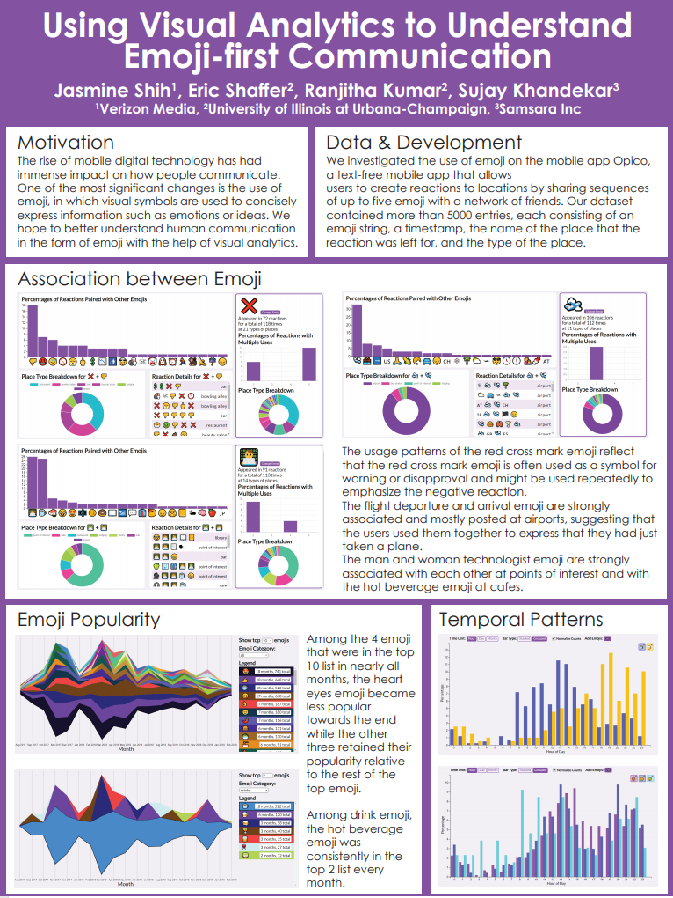

In Spring 2019, I worked with professors [Eric Shaffer](https://cs.illinois.edu/about/people/faculty/shaffer1) and [Ranjitha Kumar](http://ranjithakumar.net/) to develop visual anaylytics tools to visualize and study patterns in over 5000 entries of emoji expressions (strings of up to five emoji) posted by users of Opico, an emoji-first and location-centric social mobile platform. The Opico app is no longer being maintained or developed, but you can still access the interactive web visualizations at [https://jasmineyshih.github.io/opicoVis/](https://jasmineyshih.github.io/opicoVis/).

## Visualizations Demo
<iframe src="https://player.vimeo.com/video/361162822" width="640" height="360" frameborder="0" allow="autoplay; fullscreen" allowfullscreen></iframe>

<a href="https://vimeo.com/361162822">[VIS19 Preview] Using Visual Analytics to Understand Emoji-first Communication (poster)</a> from <a href="https://vimeo.com/vgtcommunity">VGTCommunity</a> on <a href="https://vimeo.com">Vimeo</a>.

## Poster Submission to IEEE VIS 2019
I submitted the project results as a poster to IEEE VIS 2019 and presented the poster at the conference. You can read more about the project in the [poster summary](https://jasmineyshih.github.io/pdf/Emoji_Viz_Poster_Summary.pdf).

