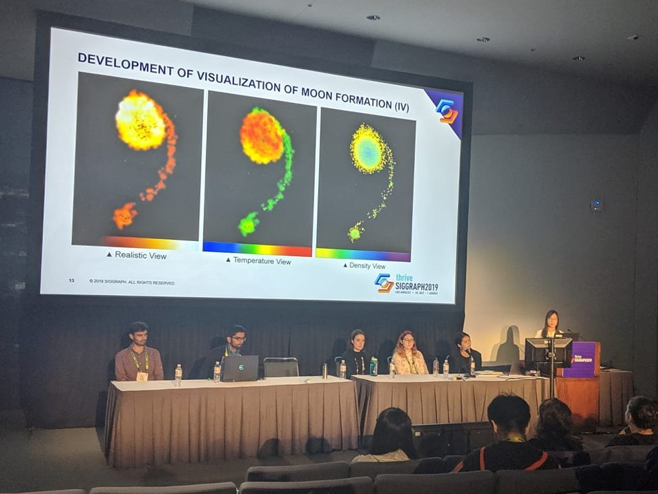

In my senior year of college, I conducted research on building interactive cinematic scientific visualizations using the Unity game engine as an intern at the NCSA Advanced Visualization Lab under the guidance of my mentors [Kalina Borkiewicz](http://publish.illinois.edu/kalina/) and [AJ Christensen](https://www.ajchristensen.com/). This project involved both technical and human components and left a significant impact on my career interests and plans.

## Visualization Demo

  <iframe src="https://www.youtube.com/embed/8lm2biVn_yM" 
          title="Moon Formation Visualization Demo" 
          allowfullscreen>
  </iframe>

## Research Stages
I like to think that I played introductory roles of a computer scientist, a visualization developer, and an HCI researcher in the three different stages of this research project.
1. Testing the performance of and experimenting with Unity's
particle system using large datasets
2. Developing an interactive cinematic visualization of a scientific model of moon formation
3. Studying the effects of our visualization on young viewers

## Poster and Abstract Submission
I submitted the project as a poster to SIGGRAPH 2019 and my submission was accepted. The poster abstract was published in the ACM SIGGRAPH 2019 proceedings here: [https://doi.org/10.1145/3306214.3338588](https://doi.org/10.1145/3306214.3338588).

↪ The research poster.

## Presentations at SIGGRAPH 2019
I presented my research methods and findings at two 75-minute poster sessions as well as the Student Research Competition. I was selected the <b>first place winner</b> in the undergraduate category at the competition. You can read about my interview with SIGGRAPH in [this ACM SIGGRAPH blog post](https://blog.siggraph.org/2019/10/scientific-visualization-in-game-engines-get-to-know-the-2019-undergrad-student-research-winner.html/). 

↪ A photo of my 10-minute presentation to a panel of judges and conference attendees.
